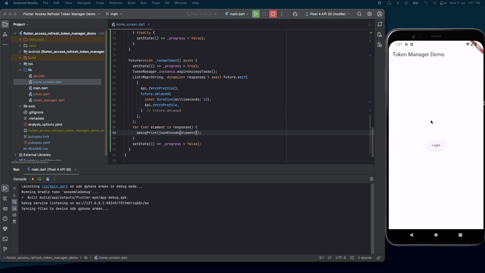

# Flutter Access Refresh Token Manager Demo

Efficiently handle access token expiration with a single request, optimizing performance during
concurrent API calls.

### Demo

### Implementation Guide

1. Copy the `TokenManager` class into your project.

2. If your token structure differs, modify the `Token` class within the `TokenManager` according to
   your specific requirements.

3. Update the `isTokenExpired` method if your authentication process varies. This method checks if
   the current token is expired.

4. Modify the `renewAccessToken` method to align with your token renewal logic. This method is
   invoked when the token expires, and a new token needs to be obtained.

5. Ensure to call the `setToken` method after a successful login or when the app is opened (if the
   user has an active session). This initializes the token manager with the user's current token.

6. Include the following line in the headers of your API call method to attach the authorization
   token:

   `"Authorization": "Bearer ${await TokenManager.instance.getAccessToken()}"`

   This ensures that the authorization header is added to your API calls requiring authentication.
   It doesn't matter which API client you use (http, dio, or others); make sure this header is
   included in the request.